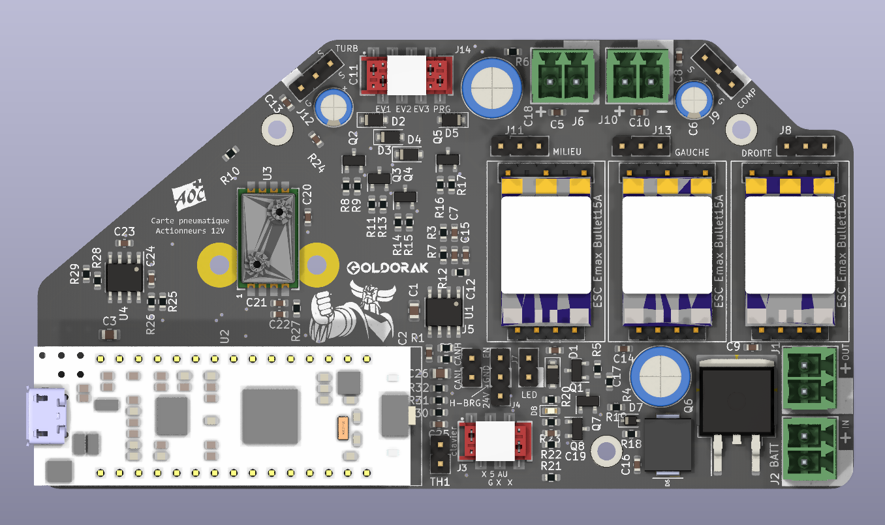

# 12v-actuators-pcb
 Carte "pneuma" du robot l'équipe Goldorak
 

## Specs composants carte actionneurs 12V
- Fuse holder keystone 3557-2
- D2PAK for p-channel mosfet ( https://fr.rs-online.com/web/p/transistors-mosfet/7105014 )
- STM32 uC: STM32F042K6 MCU sur carte de développement compatible pinout Arduino Nano
- 3 esc modules on board 15A
- 2 esc 35 off-board signal + alim, connecteur imposé
- Capteurs de pression, double emprunte
- Passer le 12V au pont en H, connecteur imposé
- Entrée NTC 100k piston compresseur -> uC
- 3 sorties électrovannes + 1 sortie purge

## Specs générales
- Tout doit être en Français de préférence
- Passer de Batt\_12V\_P à PWR12 avec fusible + arrêt d'urgence
- 5V fourni en externe (a découpler) + common mode choke?
- Échéance du draft le dimanche 26 février

## Taille de la PCB

Estimation                 |  Comparaison avec une carte bancaire
:-------------------------:|:-------------------------:
  |  

_Dimensions en mm_

## Place dans l'architecture générale

